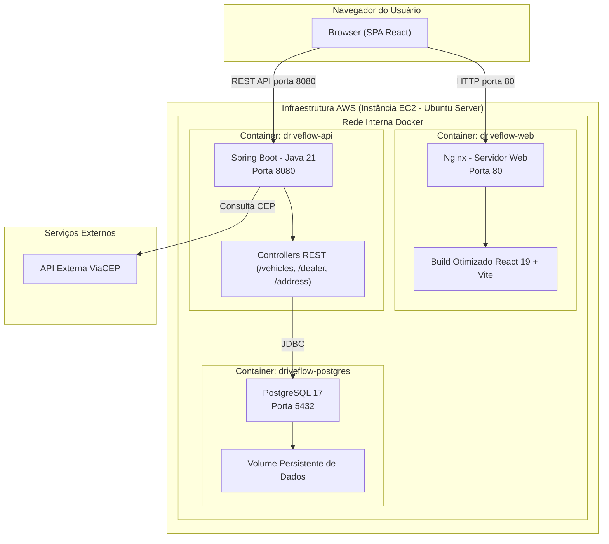

# DriveFlow Web

Interface web para o sistema de gestão centralizada de veículos e concessionárias, desenvolvida para atender aos requisitos do Desafio Técnico para Desenvolvedor Fullstack.

---

## 1. Acesso ao Ambiente em Nuvem (Deploy AWS)

A solução completa (Frontend, Backend e Banco de Dados) foi containerizada e implantada em uma instância **AWS EC2 (t3.micro)** na região `us-east-1`, atendendo integralmente ao requisito de implantação em nuvem.

* **Aplicação Web (Frontend):** [http://3.88.198.138](http://3.88.198.138)
* **Documentação da API (Swagger UI):** [http://3.88.198.138:8080/swagger-ui/index.html](http://3.88.198.138:8080/swagger-ui/index.html)
* **Repositório do Backend (API REST):** [https://github.com/luanrrsouza/driveflow-api](https://github.com/luanrrsouza/driveflow-api)

---

## 2. Desenho da Arquitetura da Solução

A arquitetura foi projetada seguindo o modelo cliente-servidor desacoplado, com orquestração completa via Docker Compose e hospedagem em nuvem na AWS.



### Detalhamento dos Componentes

1. **Camada de Apresentação (Frontend):**
   * Single Page Application (SPA) construída com React 19 e TypeScript.
   * Compilada em build estático otimizado e servida via servidor Nginx de alta performance com consumo inferior a 25 MB de memória.
   * Roteamento client-side com fallback configurado no Nginx para evitar erros 404 em atualizações de página.

2. **Camada de Serviços (Backend):**
   * API RESTful construída com Java 21 e Spring Boot.
   * Arquitetura em camadas (Controller, Service, Repository, DTOs e Mappers) com princípios SOLID e Clean Code.
   * Mapeamento relacional com Hibernate/JPA.
   * CORS configurado dinamicamente por variável de ambiente para permitir acessos controlados.

3. **Camada de Persistência:**
   * Banco de dados PostgreSQL 17 executando em container dedicado com volume persistente gerenciado pelo Docker.

4. **Integrações Externas:**
   * Consumo da API ViaCEP para preenchimento automatizado de logradouro, bairro, cidade e estado durante o cadastro de concessionárias.

---

## 3. Tecnologias e Bibliotecas Utilizadas

| Categoria | Tecnologia | Versão | Finalidade |
| :--- | :--- | :--- | :--- |
| **Core** | React | 19.x | Biblioteca principal de interface declarativa |
| **Linguagem** | TypeScript | 5.x / 6.x | Tipagem estática estrita e segurança em tempo de compilação |
| **Build Tool** | Vite | 8.x | Empacotador e servidor de desenvolvimento de alta velocidade |
| **Roteamento** | React Router | 7.x / 8.x | Navegação entre telas no modelo SPA |
| **Estado Assíncrono** | TanStack Query | 5.x | Gerenciamento de cache, revalidação e mutações assíncronas |
| **Formulários** | React Hook Form | 7.x | Controle de formulários com performance e re-renders otimizados |
| **Validação** | Zod | 4.x | Schemas de validação estritos com inferência de tipos |
| **Estilização** | Tailwind CSS | 4.x | Framework utilitário de CSS moderno |
| **Componentes UI** | shadcn/ui | 4.x | Componentes acessíveis, responsivos e customizáveis |
| **Notificações** | Sonner | 2.x | Feedbacks visuais via toasts para ações do usuário |
| **Servidor Web** | Nginx Alpine | Alpine | Servidor web leve para execução em produção |
| **Containerização** | Docker / Compose | v2 | Empacotamento reproduzível de toda a stack |

---

## 4. Estrutura Arquitetural do Frontend

O projeto adota a arquitetura modular baseada em **Features**, facilitando a manutenibilidade, coesão e escalabilidade do código:

```text
src/
├── assets/                  # Identidade visual e imagens do sistema
├── components/              # Componentes compartilhados e de layout
│   ├── layout/              # Sidebar de navegação e layout principal
│   └── ui/                  # Componentes base (shadcn/ui: button, table, dialog, etc.)
├── config/                  # Configurações globais (QueryClient)
├── features/                # Módulos de domínio da aplicação
│   ├── dealers/             # Feature: Gestão de Concessionárias
│   │   ├── components/      # Formulários e tabelas da feature
│   │   ├── hooks/           # Custom hooks do TanStack Query (useDealers, useCreateDealer)
│   │   ├── pages/           # Telas (Listagem, Cadastro, Edição)
│   │   ├── schemas/         # Schemas de validação Zod (dealerSchema)
│   │   ├── services/        # Clientes HTTP (dealerService, addressService)
│   │   └── types/           # Interfaces TypeScript da entidade e requisições
│   └── vehicles/            # Feature: Gestão de Veículos
│       ├── components/      # Formulário com suporte a combustível e moeda
│       ├── hooks/           # Hooks de consulta, filtro por concessionária e mutações
│       ├── pages/           # Telas de veículos
│       ├── schemas/         # Schemas de validação Zod (vehicleSchema)
│       ├── services/        # Clientes HTTP (vehicleService)
│       └── types/           # Enums e interfaces de veículos
├── hooks/                   # Custom hooks globais (ex.: useIsMobile)
├── lib/                     # Utilitários, formatadores e validadores matemáticos
│   ├── formatters/          # Máscaras de CNPJ, CEP, Moeda (BRL) e Endereço
│   └── validators/          # Validador algorítmico de dígitos do CNPJ
├── pages/                   # Páginas estáticas / institucionais (HomePage)
├── routes/                  # Configuração de rotas da aplicação (AppRoutes)
└── services/                # Configuração do cliente HTTP base (api.ts)
```

---

## 5. Regras de Negócio e Validações Implementadas

* **Validação Completa de CNPJ:** Implementação algorítmica do cálculo dos dois dígitos verificadores do CNPJ (com rejeição de números com todos os dígitos idênticos), validado via schema Zod (`.refine(isValidCnpj)`).
* **Validação de CEP e Busca Automática:** Máscara de CEP com chamada automática ao endpoint de endereço assim que 8 dígitos são preenchidos, bloqueando submissão caso o CEP não seja localizado.
* **Enum de Combustíveis:** Suporte estruturado aos tipos de combustível exigidos (`GASOLINA`, `ETANOL`, `FLEX`, `DIESEL`, `ELETRICO`, `HIBRIDO`).
* **Associação entre Entidades:** O cadastro e edição de veículos exigem a seleção de uma concessionária existente. A listagem de veículos permite o filtro dinâmico por concessionária.
* **Máscaras e UX:**
  * Formatação monetária em tempo real (R$) com tratamento de centavos.
  * Skeletons animados durante o carregamento de tabelas e formulários.
  * Modais com confirmação destrutiva (`AlertDialog`) para exclusão de registros.
  * Layout responsivo com menu adaptativo para dispositivos móveis.

---

## 6. Instruções de Execução

### Pré-requisitos
* Git
* Node.js 20+ e npm (para execução local em desenvolvimento)
* Docker e Docker Compose (para execução em containers)

---

### Opção A: Execução Completa via Docker Compose (Recomendado)

Esta opção inicializa o Frontend, o Backend e o PostgreSQL simultaneamente.

1. Clone ambos os repositórios em um mesmo diretório raiz:
   ```bash
   git clone https://github.com/luanrrsouza/driveflow-api.git
   git clone https://github.com/luanrrsouza/driveflow-web.git
   ```

2. Acesse a pasta do backend:
   ```bash
   cd driveflow-api
   ```

3. Inicie os containers com build:
   ```bash
   docker compose up -d --build
   ```

4. Acesse as aplicações:
   * **Frontend:** [http://localhost](http://localhost) (ou porta 80)
   * **Backend:** [http://localhost:8080](http://localhost:8080)
   * **Swagger UI:** [http://localhost:8080/swagger-ui/index.html](http://localhost:8080/swagger-ui/index.html)

---

### Opção B: Execução Local do Frontend em Modo de Desenvolvimento

Caso deseje executar apenas o frontend em ambiente de desenvolvimento (com HMR):

1. Acesse o diretório do projeto:
   ```bash
   cd driveflow-web
   ```

2. Crie o arquivo de variáveis de ambiente com base no exemplo:
   ```bash
   cp .env.example .env
   ```
   *Certifique-se de que a variável `VITE_API_URL` aponta para o backend em execução (ex.: `http://localhost:8080`).*

3. Instale as dependências:
   ```bash
   npm install
   ```

4. Inicie o servidor de desenvolvimento:
   ```bash
   npm run dev
   ```

5. O frontend estará acessível em: [http://localhost:5173](http://localhost:5173).

---

## 7. Variáveis de Ambiente

O frontend utiliza as seguintes variáveis de ambiente configuráveis via `.env`:

| Variável | Descrição | Exemplo Local | Exemplo Nuvem |
| :--- | :--- | :--- | :--- |
| `VITE_API_URL` | URL base da API REST do backend | `http://localhost:8080` | `http://3.88.198.138:8080` |

---

## 8. Metodologia e Gestão Ágil do Projeto

O desenvolvimento da solução seguiu princípios ágeis de entrega contínua e rastreabilidade:

* **GitHub Projects (Kanban):** Todo o escopo funcional foi decomposto em issues rastreáveis distribuídas em colunas (*Backlog*, *In Progress*, *Done*).
* **Conventional Commits:** Histórico de commits estruturado utilizando convenções semânticas (`feat`, `fix`, `refactor`, `chore`).
* **Pull Requests e Code Review:** Features desenvolvidas em branches separadas com merges documentados na branch `main`.
